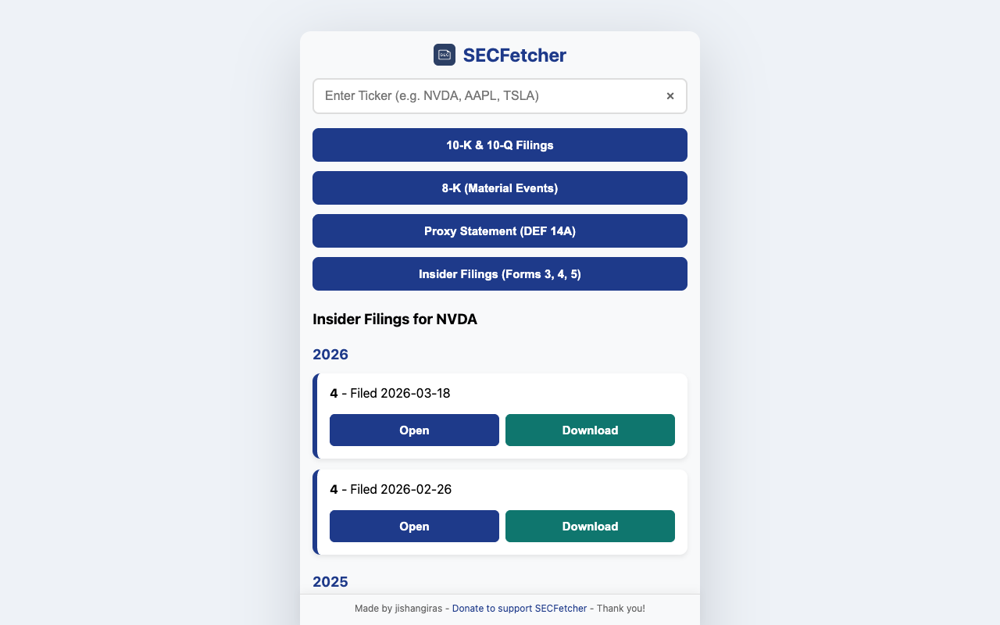

# SECFetcher

Fast SEC EDGAR filing lookup from your browser.

SECFetcher is a lightweight browser extension for quickly finding, opening, and downloading public SEC filings by stock ticker. It is built for investors, analysts, founders, students, and builders who often need fast access to annual reports, quarterly reports, material event filings, proxy statements, and insider ownership reports.



## Features

- Search public companies by ticker symbol.
- Fetch recent SEC EDGAR filings from official SEC APIs.
- View 10-K and 10-Q annual and quarterly filings.
- View 8-K material event filings.
- View DEF 14A proxy statements.
- View Forms 3, 4, and 5 insider ownership filings.
- Open filings directly on sec.gov.
- Download the original SEC filing document.
- Clear ticker and results with one click.
- Stores only the latest popup results locally in your browser.

## Why SECFetcher?

The SEC EDGAR website is powerful, but repeated lookup is slow when you just want the latest filings for a company. SECFetcher puts the most common filing searches in a tiny browser popup:

- `10-K`
- `10-Q`
- `8-K`
- `DEF 14A`
- `Form 3`
- `Form 4`
- `Form 5`

No account, no analytics, no tracking.

## Install From Source

### Chrome, Edge, Brave, Arc, and other Chromium browsers

1. Download or clone this repository.
2. Open `chrome://extensions`.
3. Enable `Developer mode`.
4. Click `Load unpacked`.
5. Select the SECFetcher project folder.
6. Pin SECFetcher from the extensions menu.

For Edge, use `edge://extensions`.

### Firefox

1. Open `about:debugging#/runtime/this-firefox`.
2. Click `Load Temporary Add-on`.
3. Select `manifest.json` from this repository.

Firefox temporary add-ons are removed when Firefox restarts. A signed Firefox Add-ons build is planned.

## Download Package

Packaged ZIPs are generated locally and attached to GitHub Releases:

```text
dist/secfetcher-edge-v1.1.zip
dist/secfetcher-firefox-v1.1.zip
```

See [RELEASE.md](RELEASE.md) for build, verification, and release steps.

## Privacy

SECFetcher does not collect, sell, or share personal data.

The extension uses:

- `storage` to save the latest visible filing results locally in your browser.
- `downloads` to save SEC filing documents when you click Download.
- `sec.gov` and `data.sec.gov` host permissions to fetch public SEC filing data.

Read the full [privacy policy](PRIVACY_POLICY.md).

## Data Sources

SECFetcher uses public SEC endpoints:

- `https://www.sec.gov/files/company_tickers.json`
- `https://data.sec.gov/submissions/CIK##########.json`
- `https://www.sec.gov/Archives/edgar/data/...`

This project is not affiliated with or endorsed by the U.S. Securities and Exchange Commission.

## Keywords

SEC filings, SEC EDGAR, EDGAR browser extension, 10-K lookup, 10-Q lookup, 8-K lookup, proxy statement, DEF 14A, Form 3, Form 4, Form 5, insider filings, insider transactions, beneficial ownership, annual report, quarterly report, financial filings, stock ticker SEC filings, investor research, public company filings, Chrome extension, Edge extension, Firefox extension.

## Development

This is a plain WebExtension project with no build step.

Core files:

- `manifest.json`
- `popup.html`
- `popup.js`
- `background.js`
- `icons/`

Validate JavaScript syntax:

```sh
node --check popup.js
node --check background.js
```

Create a Chrome/Chromium ZIP:

```sh
node scripts/build-store-packages.js
```

See [CHANGELOG.md](CHANGELOG.md) for release history.

## Roadmap

- Publish free builds on GitHub Releases.
- Submit to Microsoft Edge Add-ons.
- Submit to Firefox Add-ons.
- Add optional CIK search.
- Add company name display.
- Add filing accession number display.

## License

MIT License. See [LICENSE](LICENSE).
